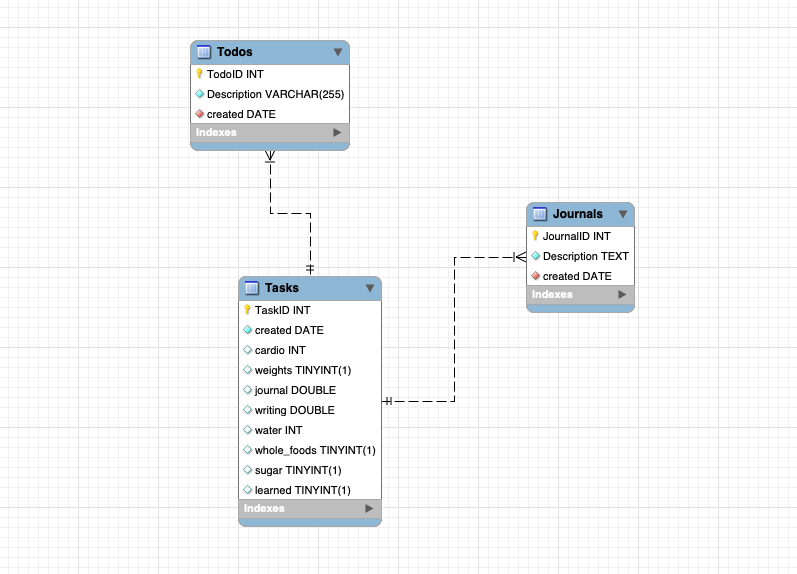

# Revature Project Zero - Jay Womack

## To run project:

### Create a virtual environement by:

> python3 -m venv /path/to/new/virtual/environment

### Activate venv by running this command in terminal:

> source <path_to_venv>/bin/activate

### Install required packages:

> pip install -r requirements.txt

### Run program

> run main.py

&nbsp;

# Python&nbsp; | &nbsp; MySQL&nbsp; | &nbsp;CLI Productivity App

## **Description:** A productivity app that will allow a user to track daily habits, write journals, and write todos. Todos, journals, and tasks and can be written to external files. Tasks can be added from the past, from excel files.

&nbsp;

## Development LifeCycle

---

&nbsp;

### 1. Plan

### 2. Design

### 3. Code

### 4. Test

### 5. Deploy

---

&nbsp;

# Tech Stack:

> ## Python 3.9.13

> ## MySQL 8.0.29

---

&nbsp;

# Packages:

&nbsp;

> ## pandas for manipulating data and read/write files

> ## sqlalchemy to create engine to import Excel file into MySQL db

> ## pymysql for database connection

> ## signal for signal handlers (kill terminal on menu quit)

> ## time for datestamps in 'created' fields

> ## tabulate for rendering data to tables in terminal

> ## os for operating system functions

> ## dotenv for hiding variables

---

&nbsp;

# Project Management:

> ## Jira

> ## Agile

> ## Kanban

> ## Vs Code 1.68.0

&nbsp;

# ERR Diagram

